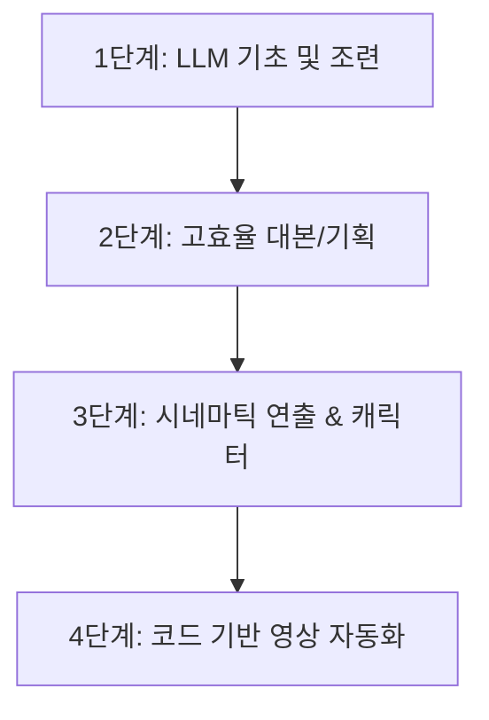

# 📖 AION AI 영상 자동화 & 프롬프트 학습 로드맵 및 지식 맵 (Learning Roadmap)

이 문서는 **AION(에이아이온)** 네이버 카페의 무료 전자책 도서 목록을 바탕으로, **`숏폼공장`** 프로젝트 및 마케터/개발자가 향후 학습하고 파이프라인에 적용할 수 있도록 정리한 체계적인 **학습 로드맵 및 지식 지도(Knowledge Map)**입니다.

---

## 🗺️ 1. 단계별 학습 로드맵 (4단계 코스)

AION 무료 전자책의 난이도와 주제에 따라 아래와 같이 4단계로 구성하여 순차적인 학습을 권장합니다.

### 🟩 1단계: LLM 기초 및 조련 (기본기 다지기)
*   **학습 대상 도서:**
    1.  **`구글 Gemini 조련 가이드북`** (25.12.17) `[★ main.py 반영 완료]`
    2.  **`직장인이 챗GPT 업무에 써도 "별거 없네" 하는 진짜 이유 (자이언트 브레인)`** (26.06.09)
*   **학습 목표:** LLM(대형 언어 모델)의 작동 방식을 이해하고, 명령어(프롬프트) 작성 시 발생하는 변덕과 무작위성을 통제하는 기본 조련 프레임 확보.

### 🟦 2단계: 숏폼 대본 및 기획 고도화 (상위 1% 프롬프팅)
*   **학습 대상 도서:**
    1.  **`상위 1% 유튜버의 제미나이 프롬프트 치트키`** (25.09.17) `[★ main.py 반영 완료]`
    2.  **`경제학 롱폼 영상 제작 치트키 PDF (초보자 전용)`** (26.02.09)
*   **학습 목표:** 
    - **PAOF 4원칙** (Persona, Action, Objective, Format)에 기반한 카피라이팅 설계.
    - 이탈을 방어하는 **3초 강력 HOOK** 인트로 설계 및 최종 유입을 만드는 **CTA(행동 촉구)** 시나리오 빌드.
    - 롱폼/숏폼 서사 구조 설계 능력 획득.

### 🟨 3단계: 시네마틱 비주얼 및 일관된 캐릭터 연출 (비주얼 퀄리티)
*   **학습 대상 도서:**
    1.  **`시네마틱 연출 치트키 PDF`** (25.12.15)
    2.  **`AI 캐릭터 & 시네마틱 연출 치트키 PDF`** (26.03.03) `[★ main.py 반영 완료]`
    3.  **`[만능 프롬프트] 제미나이 햄스터 인터뷰 제작용 핵심 프롬프트 모음`** (26.03.11)
    4.  **`[씨댄스 2.0] 영상에서 사용한 프롬프트 전체 공개`** (26.04.10)
*   **학습 목표:**
    - 이미지 생성 시 랜덤 박스 현상을 방지하는 **6단계 프롬프트 공식** 마스터.
    - 어색한 "AI 느낌"을 지우기 위한 영화 질감 질감 및 조명 세팅.
    - 3D 애니메이션 스타일(픽사 등)을 통한 일관성 있는 **AI 페르소나 캐릭터(제미 등) 설계** 및 상황별 일관된 표정 연출.
    - 카메라 무빙 앵글 사전을 이용한 모션 캡처 통제.

### 🟥 4단계: 코드 기반 영상 자동화 파이프라인 구축 (개발 및 확장)
*   **학습 대상 도서:**
    1.  **`클로드 코드 영상 자동화 무료 프롬프트 PDF`** (26.06.04)
    2.  **`클로드+힉스필드 MCP 광고영상 자동화 스킬`** (26.07.03)
*   **학습 목표:**
    - Claude API 및 MCP(Model Context Protocol) 기술을 연동하여 개발자가 일일이 자막과 이미지를 매칭하지 않고 코드로 자동 렌더링하는 엔지니어링 스택 구축.
    - Luma, Veo, 힉스필드(Luma Ray 대체용 AI 비디오 엔진) 등의 비디오 생성 API 완전 자동 결합.

---

## 🧠 2. 도서별 핵심 테마 및 지식 요약

| 전자책 제목 | 핵심 키워드 | 프로젝트 적용 방안 및 비즈니스 의의 |
| :--- | :--- | :--- |
| **상위 1% 제미나이 치트키** | PAOF 원칙, HOOK, CTA | 숏폼 영상 제작 시 랜딩 페이지 유입률(CVR) 향상 및 타겟 오디언스 3초 도달률 극대화 |
| **시네마틱 연출 치트키** | 6단계 공식, 35mm film, Soft light | 이미지 생성 시 전형적인 AI 광택을 제거하여 상업 광고 소재용 영화 같은 사실감 부여 |
| **AI 캐릭터 연출 치트키** | Anthropomorphic, 3D Pixar, Jemie | 고정된 홍보 아바타(페르소나)를 활용한 지속 가능한 브랜딩 콘텐츠(예: 햄스터 인터뷰 등) 양산 |
| **클로드 코드 영상 자동화** | Python, API automation, Claude | 숏폼공장 백엔드 코드를 클로드 프롬프트만으로 확장, 배포 스크립트 작성 자동화 |
| **힉스필드 MCP 자동화** | Luma/Luma Ray 대체, MCP, Video API | Replicate 의존성을 낮추고, 힉스필드(Higgsfield) 영상 생성 모델을 통한 모션 퀄리티 극대화 |

---

## 🛠️ 3. 숏폼공장 프로젝트 현황 및 로드맵 연계

*   **현재 구현 상태:**
    - [main.py](file:///c:/커셔/숏폼공장/main.py) 및 [Gemini_Prompt_Applied_Framework.md](file:///c:/커셔/숏폼공장/Gemini_Prompt_Applied_Framework.md)에 **1단계의 'Gemini 조련 가이드북(텍스트 방지 네거티브 및 일관성)'**, **2단계의 'PAOF 치트키'**, 그리고 **3단계의 '6단계 시네마틱 연출 및 텍스트 박음 공식'**을 엔진 코드로 이식 완료.
*   **다음 학습 및 개발 목표 (4단계 연계):**
    - **힉스필드(Higgsfield) & MCP 비디오 결합**: Replicate(Luma Ray) 뿐만 아니라 AION 최신 도서에 언급된 **힉스필드 MCP** 기술을 점검하여 영상 무빙 퀄리티 및 렌더링 비용 최적화.
    - **경제학 롱폼 공식의 숏폼화**: 마케팅 중심의 '소구점 극대화' 플로우를 `coupax_integration`에 업데이트.

---

*본 로드맵은 새로운 전자책 분석 자료 및 API 기능 추가가 있을 때마다 최신화됩니다.*
